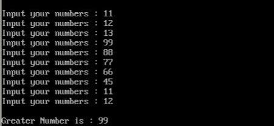

# Find-Max-Number

My 1st project was in "Computer Architecture" courses when I was in 3rd semester of my bachelor's at IAUSTB. This Program finds the maximum numbers between a list of them.

|  | 
|:--:| 
| *Sample Output* |

