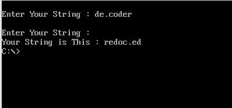

# Inverse-String

My 2nd project was in "Computer Architecture" courses when I was in 3rd semester of my bachelor's at IAUSTB. This Program gives the inverse of a string.

|  | 
|:--:| 
| *Sample Output* |

